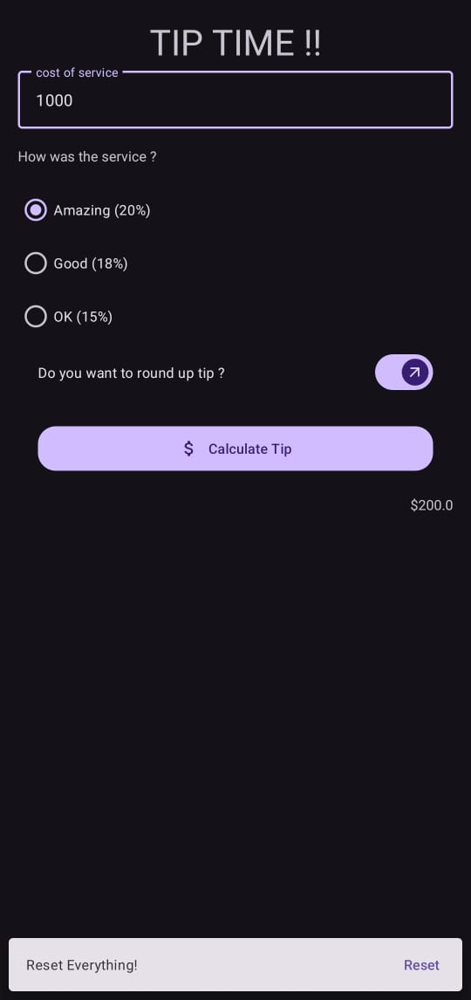

# Tip Time App
A simple tip calculator app built as part of the Android Basics in Kotlin course.

# This app demonstrates fundamental Android development concepts including:

- User interface creation with XML layouts
- Handling user input with EditText
- Performing calculations and displaying results
- Using basic Kotlin syntax and control flow

# Key features:

- Allows users to enter the bill amount
- Calculates the tip based on selected percentage (15%, 20%, or 18%)
- Displays the calculated tip amount
- Optional rounding of the tip amount

  # App Snapshots
  
  

  
